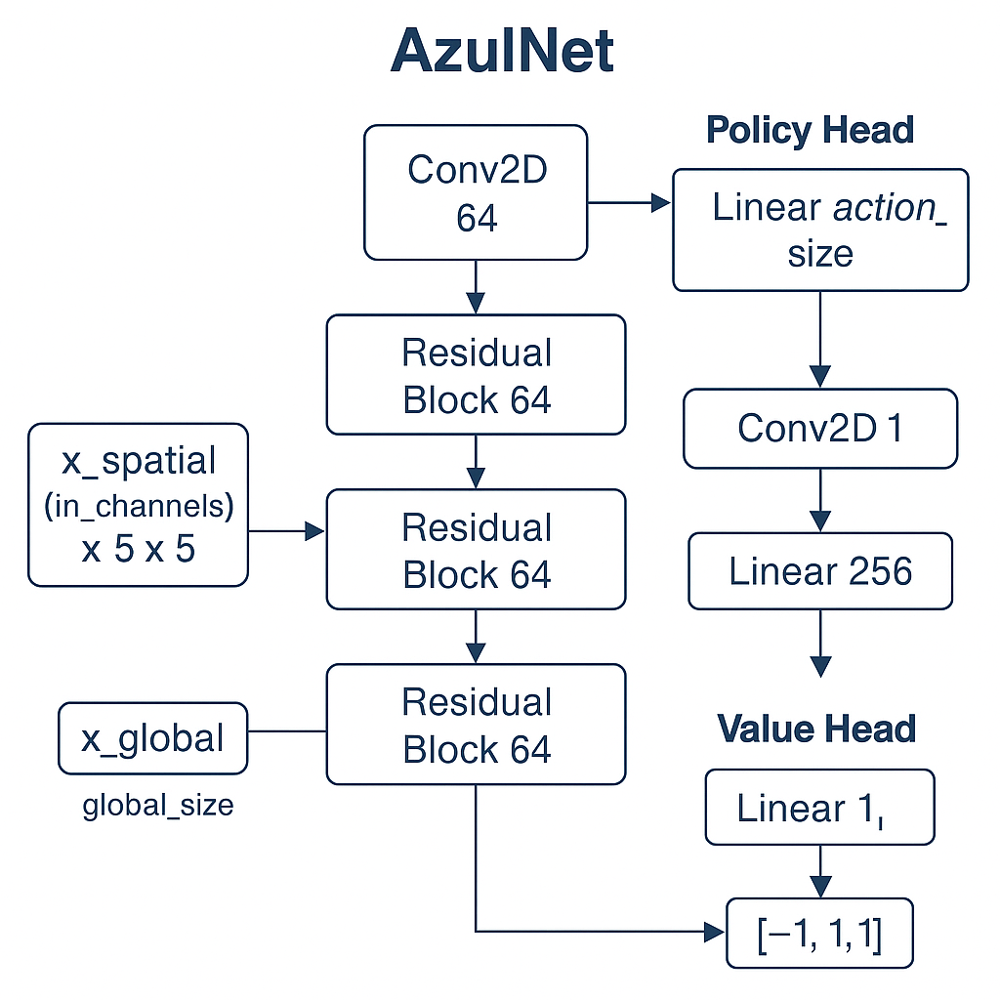

# Azul Zero

A self-play reinforcement learning framework for the board game *Azul*, inspired by AlphaZero and AlphaGo Zero. This project implements:

- **Game logic** and **rule enforcement** for Azul.
- **Monte Carlo Tree Search (MCTS)** for decision making.
- A **deep neural network** (policy & value) using PyTorch.
- **Self-play training loop** to iteratively improve the network.
- **Evaluation** against previous network versions to track progress.

## Table of Contents

- [Installation](#installation)  
- [Project Structure](#project-structure)  
- [Usage](#usage)  
  - [Play a Random Game](#play-a-random-game)  
  - [Run MCTS Demo](#run-mcts-demo)  
  - [Train the Neural Network](#train-the-neural-network)  
- [Configuration](#configuration)  
- [Testing](#testing)  
- [Contributing](#contributing)  
- [License](#license)  

## Installation

1. Clone the repository:
   ```bash
   git clone https://github.com/yourusername/azul_zero.git
   cd azul_zero
   ```
2. Create a virtual environment and install dependencies:
   ```bash
   python3 -m venv .venv
   source .venv/bin/activate
   pip install -r requirements.txt
   ```
3. (Optional) For GPU acceleration on Apple Silicon, install PyTorch with MPS support:
   ```bash
   pip install torch==2.7.0 torchvision --index-url https://download.pytorch.org/whl/nightly/cpu
   ```

## Project Structure

```text
azul_zero/
├── src/
│   ├── azul/
│   │   ├── env.py          # Environment and game state management
│   │   ├── rules.py        # Azul game rules and scoring
│   ├── mcts/
│   │   └── mcts.py         # Monte Carlo Tree Search implementation
│   ├── net/
│   │   └── azul_net.py     # PyTorch model for policy and value
│   ├── train/
│   │   ├── self_play.py    # Generate self-play examples using MCTS + network
│   │   └── trainer.py      # Training loop, loss computation, TensorBoard logging
│
├── scripts/
│   ├── random_game.py      # Run a random-play demonstration
│   ├── demo_mcts.py        # Demonstrate MCTS + network in action
│   └── train_azul.py       # Main training script
│
├── tests/                  # Unit tests for rules and environment
├── requirements.txt        # Python dependencies
└── README.md               # This file
```

## Usage

### Play a Random Game

```bash
python3 scripts/random_game.py
```

### Run MCTS Demo

```bash
python3 scripts/demo_mcts.py \
  --simulations 200 \
  --cpuct 1.0
```

### Train the Neural Network

```bash
python3 scripts/train_azul.py \
  --n_games 100 \
  --simulations 200 \
  --epochs 20 \
  --eval_interval 5 \
  --eval_games 100 \
  --resume checkpoints/model_epoch_20.pth
```

Key options:

- `--n_games`: Number of self-play games to generate per epoch.  
- `--simulations`: MCTS simulations per move.  
- `--epochs`: Training epochs per run.  
- `--eval_interval`: Evaluate against previous network every N epochs.  
- `--eval_games`: Number of games in each evaluation.  
- `--resume`: Path to a checkpoint to continue training.

### Distributed Training & Merging

To train the AI on multiple machines and combine results:

1. **Set machine ID (e.g. `mac` or `lg`)**:
   ```bash
   export AZUL_MACHINE_ID=mac
   ```
   > 💡 Tip: To make this permanent, add the line `export AZUL_MACHINE_ID=mac` (or `lg`) to your `~/.zshrc` or `~/.bash_profile`, then run `source ~/.zshrc` (or `source ~/.bash_profile`) to apply the change.

2. **Run training normally** (files will be tagged with the machine ID):
   ```bash
   python3 scripts/train_azul.py \
     --n_games 100 \
     --simulations 200 \
     --epochs 20 \
     --eval_interval 5 \
     --eval_games 100
   ```

3. **After training**, move the replay buffers and latest checkpoints to a shared location or one of the machines.

4. **Merge and evaluate models** using:
   ```bash
   python3 scripts/merge_all.py
   ```

This will:
- Merge the replay buffers from both machines (e.g. `replay_buffer_mac.pkl` and `replay_buffer_lg.pkl`) into `replay_buffer_merged.pkl`
- Select the better model between `checkpoint_latest_mac.pth` and `checkpoint_latest_lg.pth`, saving it as `checkpoint_best.pth`

Future training runs will automatically pick up the best checkpoint and merged replay buffer if present.

## Configuration

- The **observation encoding** and **action encoding** are defined in `src/azul/env.py`.
- Adjust network architecture in `src/net/azul_net.py`.
- Tweak MCTS parameters in `src/mcts/mcts.py`.

## Testing

Run unit tests for game logic and environment:

```bash
python3 -m unittest discover -v tests
```

## Contributing

1. Fork the repository  
2. Create a feature branch  
3. Write tests and ensure existing tests pass  
4. Submit a pull request  

## License

This project is licensed under the MIT License.  

## Model Architecture

The following diagram illustrates the neural network architecture used in Azul Zero:


